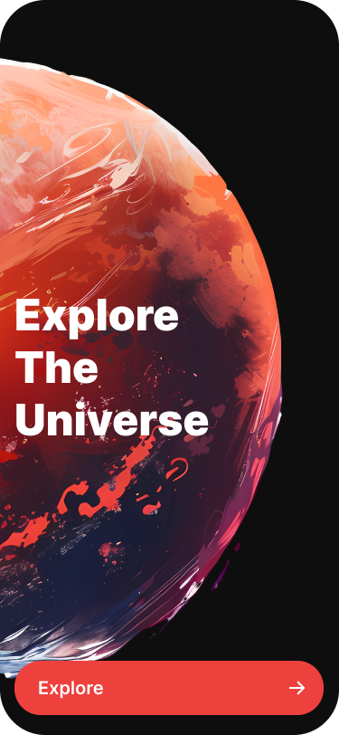

# 🚀 Space App

**Space App** is a Flutter-based mobile application that allows users to explore the wonders of our solar system. Designed to educate and inspire, this app delivers an immersive and interactive journey through space.

  

---

## 🌌 App Goals

- 🎓 **Educate users** with rich, accurate, and engaging information about planets.
- 🌠 **Inspire curiosity** in astronomy and space exploration.
- 🖼️ **Visual immersion** through high-quality images, animations, and interactive 3D elements.
- 🧭 **User-friendly experience** for all age groups.
- 🌍 **Facilitate exploration** with smooth navigation between planets and deep-dive details.

---

## ✨ Features

- 🌍 Swipe or navigate between planets with smooth animations.
- 🔭 Tap to **Explore** any planet and view detailed data in a dedicated screen.
- 📸 Interactive **3D models** of planets using `flutter_3d_obj` or `flutter_3d_controller`.
- 🌌 Elegant and dark-themed space UI.
- 🔴 Navigation buttons & animated transitions.

---

## 🖥️ Screen Previews

  
  
  
  

---

## 🛠️ Tech Stack

- ✅ **Flutter**
- 🧠 **flutter_3d_controller** for 3D models
- 🎨 Clean UI/UX with smooth animations
---

## 📂 Assets

All planets are included as **3D Models** in the assets folder. Each planet’s data and model is dynamically loaded when users navigate between them.

